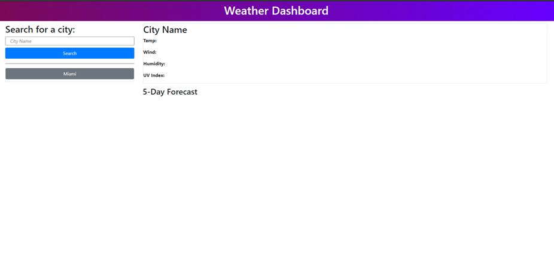
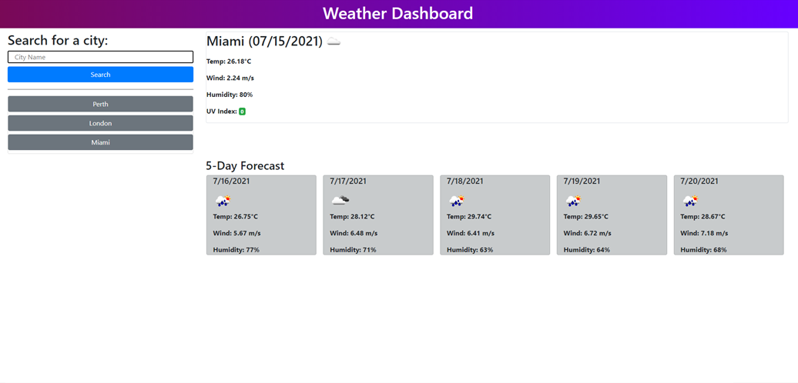

# HW6-weather-dashboard-pasgen-manley

## Deployed Application
 https://pasgen-manley.github.io/HW6-weather-dashboard-pasgen-manley/

### Project Description

The requirements of this project were to develop a weather dashboard application using the open weather API. I was to create a dashboard where a user can input the name of any city into a search bar and received information on the current weather of that city, as well as, the forecast for the next 5 days. Additionally, if the user searches the weather conditions of another city then the previously city entries are saved on local storage and are displayed as buttons under the search bar. 

#### Project Functionality Examples

How the application looks before inputs

How the application looks after city inputs
